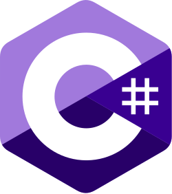
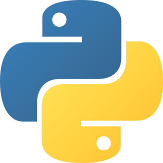
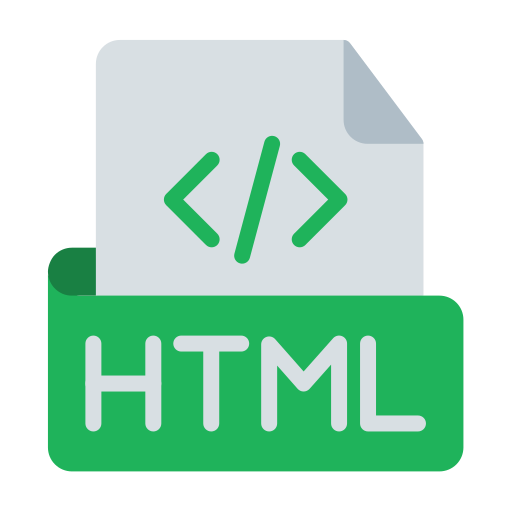
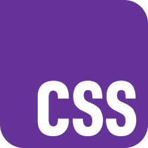
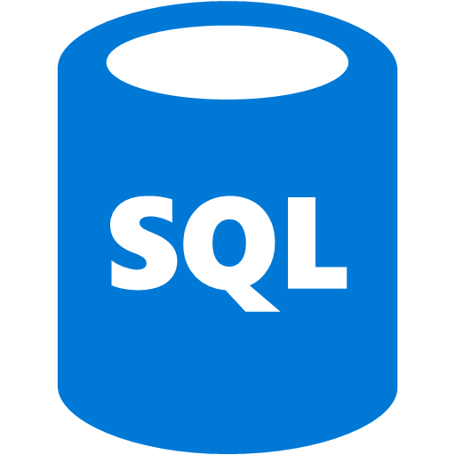

# Hi, I'm Ilian

I am a Computer Engineer with a technical background and experience across multiple programming languages and development areas.  
I have worked on building software systems, web applications, and mobile solutions, focusing on writing clean, maintainable code and solving real-world problems.  
I am continuously learning and improving my skills, with an interest in developing efficient, scalable, and well-structured applications.

---

## Backend & Core Technologies

  
  
  
  
  

## Frontend

  
  
  

## Database

  
  

